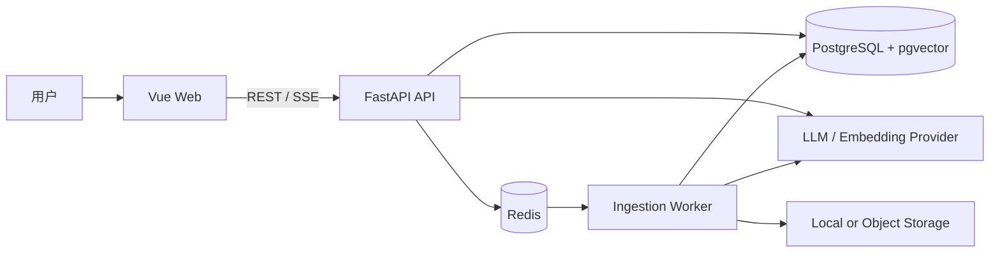
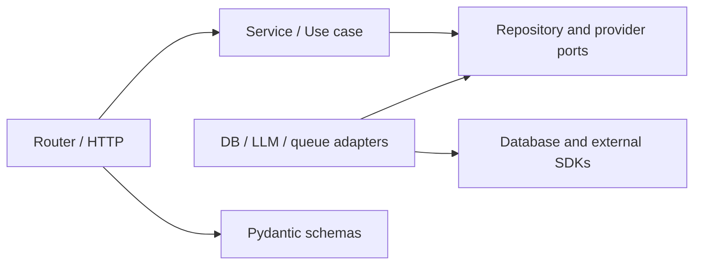

# SourceTrace 架构说明

## 1. 目标与约束

SourceTrace 是面向私有资料的可追溯 RAG 应用。系统必须同时满足：证据可定位、
答案可审计、证据不足时拒答、摄取任务可恢复，以及模型供应商可替换。

当前阶段采用模块化单体。API 与 Worker 独立部署，但共享领域和应用代码。该选择能保留
清晰边界与独立扩缩容能力，又避免在业务和容量尚未稳定时承担分布式事务与跨服务运维成本。

## 2. 系统上下文



## 3. 代码结构

```text
sourcetrace/
  apps/
    api/
      migrations/                 Alembic 数据库迁移
      scripts/                    OpenAPI 导出等开发脚本
      src/sourcetrace/
        api/                       路由聚合与 API 版本
        core/                      配置、日志、错误、中间件
        db/                        Engine、Session、ORM 基类
        modules/                   业务纵向切片
          health/                  存活与就绪检查
          <feature>/               router/service/repository/schema/model
        rag/                       RAG 跨模块编排与供应商端口
        evaluation/                版本化数据、评分、离线与真实评测适配
        workers/                   独立 Worker 进程入口
      tests/
        unit/                      纯逻辑测试
        integration/               API + 基础设施测试
        contract/                  OpenAPI 与适配器契约测试
    web/
      src/
        app/                       应用装配、路由、全局样式
        features/                  前端业务纵向切片
        shared/                    API 客户端和通用 UI
  docs/
    adr/                           架构决策记录
  evals/                           可版本化、去敏后的评测数据和配置
  infra/                           数据库、代理和部署配置
  scripts/                         跨应用工程脚本
  data/uploads/                    仅本地运行时数据
```

## 4. 后端依赖规则



依赖始终指向业务规则。Service 接受普通 Python 值或领域对象，不接受 `Request`、
`Response`、`HTTPException`。Repository 不决定“证据是否足够”等产品规则。外部供应商
实现端口接口，便于在单元测试中使用确定性的 fake。

一个典型请求的控制流是：

1. Router 校验输入并解析调用者上下文。
2. Service 执行业务规则和用例编排。
3. Repository/Provider adapter 访问 PostgreSQL、Redis 或模型 API。
4. Service 返回领域结果，Router 映射为稳定的 API schema。

## 5. 核心业务边界

| 模块 | 职责 | 不负责 |
|---|---|---|
| `knowledge_bases` | 知识库生命周期和访问范围 | 文档解析实现 |
| `documents` | 上传元数据、摄取状态、重试和删除 | 回答生成 |
| `conversations` | 知识库绑定的会话与不可变问题历史 | 检索与回答生成 |
| `retrieval` | 查询改写、召回、重排和证据集合 | HTTP 流式协议 |
| `answers` | 引用约束、拒答策略和回答运行 | 文档存储 |
| `evaluation` | 数据集校验、分轴评分和可重放报告 | 在线回答生命周期 |
| `identity` | 用户身份和授权策略 | 业务资源查询 |
| `health` | 存活与依赖就绪状态 | 业务监控面板 |

这些目录应随对应纵向切片实现时创建，不预先生成无行为的空类。

## 6. 数据与任务

PostgreSQL 是业务状态和向量的权威存储。Redis 仅用于队列、短期缓存和任务协调，所有
缓存键都必须有 TTL。上传内容在数据库中只保存元数据与存储键，文件放本地开发目录或
对象存储。

文档摄取流程为：上传登记 -> 持久化原文件 -> 投递任务 -> 解析 -> 切分 -> 嵌入 ->
写入片段与向量 -> 标记完成。每一步以文档版本和处理阶段作为幂等键；失败进入有限重试，
最终进入失败状态供人工重放。

解析与切分阶段可独立落入 `chunked` 中间状态，供后续嵌入任务继续处理。`chunked` 版本
不可检索；只有向量完整写入并激活后才进入 `completed`。

BGE-M3 通过 `EmbeddingProvider` 端口接入，适配器负责批处理、1024 维契约和单位归一化
校验。Chunk 向量与文档版本的 `completed` 激活在同一个 PostgreSQL 事务中提交；检索范围
始终过滤为每个逻辑文档最新的 `completed` 版本，因此部分写入、处理失败和更新中的版本
不会进入召回范围，历史版本仍可按稳定 ID 访问。

Dense 检索先读取有界候选池，再优先选择不同文档版本与页码组合，最终主候选数量仍受
`top_k` 限制；同页相邻 chunk 只在主候选确定后补入，并继承触发候选的分数。该顺序避免
单页重复 chunk 挤占全部主候选，同时保持知识库和文档版本范围不变。

会话创建时显式写入知识库 ID，此后不能变更作用域。问题通过会话 ID 与知识库 ID 的复合
外键归属会话，跨知识库查询始终返回未找到。会话列表按创建时间和 UUID 倒序分页，问题
历史按创建时间和 UUID 正序分页，使重复时间戳下的顺序仍然稳定。问题仅记录用户输入，
不作为证据。每次回答尝试创建独立的 Answer Run，记录模型、提示词、检索配置和工作流版本；
成功回答只保存实际被正文引用的 Citation，证据不足或修复后的模型输出仍未引用允许证据时
保存 Refusal。
Citation 指向不可变文档版本和片段，并复制页码与短摘录，保证历史回答可审计且来源文件仍能
按版本打开。

追问解析只读取按时间排序的最近若干条 Question，默认上限为 4；Answer 和 Citation 不进入
改写器输入。改写器将当前问题转换为独立 Retrieval Query，每轮仍使用 Conversation 绑定的
Knowledge Base 重新执行向量检索。最终回答生成器接收用户原始问题和本轮新检索到的证据，
因此回答语言跟随原问题，Citation excerpt 保留文档原文。实际 Retrieval Query 与改写提示词
版本写入 Answer Run，供重放和评测使用。

当前回答决策由 `rag/workflow.py` 中的有界 LangGraph 深模块编排，对外只暴露
`AnswerWorkflow.run(request)` 事件流接口。固定节点为问题分析、初始检索、结构化证据判断、
可选的单次补充检索、生成、引用校验、可选的单次引用修复，以及回答或拒答终态。补充检索
始终使用 Conversation 绑定的 Knowledge Base；生成器只能接收证据判断选中的 Chunk；最终
只持久化正文实际引用的 Citation。供应商分片在校验前可作为临时 SSE delta 展示，只有通过
确定性引用校验的最终结果才成为持久事实。

`answers` Service 继续拥有 Answer Run 生命周期、事务和 SSE 映射，LangGraph 不直接完成回答
或拒答持久化。工作流通过窄运行控制接口记录初始 Retrieval Query、有界决策轨迹并读取取消
状态。决策轨迹包含实际执行的检索查询、每次结构化证据判断及所选 Chunk ID、补充检索次数和
引用修复次数，使补充检索与修复路径可以重放和评测。工作流在每个节点边界及等待模型分片
期间检查取消；图流、节点任务和上游模型流按层级显式关闭，避免断连后遗留数据库或供应商
任务。

Answer Run 使用 `pending -> running -> completed | failed` 的正常状态路径。用户取消时，活动
状态先转为 `cancel_requested`，工作流在检索前后、生成前、模型分片之间和最终持久化前检查
该状态，再转为 `cancelled`。生成期间以短间隔检查数据库取消状态；取消或 SSE 消费端断开时
关闭供应商异步响应流。取消前已经发送给浏览器的 delta 只存在于内存和界面中，取消后立即
丢弃，禁止写入 Answer Run 或进入后续问题上下文。

PostgreSQL 部分唯一索引保证同一 Conversation 在 `pending`、`running` 或
`cancel_requested` 中最多只有一个 Answer Run；不同 Conversation 不共享该锁。该数据库
约束是跨 API 进程的最终并发保护，服务层将冲突转换为稳定的 `409` 错误。

当前部署契约是单 API 进程。进程启动时会把上次进程遗留的活动 Answer Run 标记为
`failed`，防止会话被活动运行唯一索引永久阻塞；未知的工作流异常也会回滚当前事务并将运行
安全地终态化。未来若引入多个 API 副本，必须先用租约或实例所有权替代该启动恢复策略。

评测作为进程外工具复用公开应用接缝，不进入在线 Router 或 Answer Run 生命周期。版本化
Dataset 保存完整不可变文档版本快照，以及预期回答或拒答、页码和证据摘录；Harness 分别计算检索召回、
引用正确性、拒答和端到端结果。离线模式消费确定性 fixture，真实模式用记录型检索适配器包装
生产 RetrievalService，把 pgvector 限定在该快照，并消费 AnswerWorkflow 的最终事件。真实
运行从快照 chunk 对应的 completed Ingestion Run 读取实际 parser、切分和 embedding
provenance；不完整或混用配置的快照不能运行。Report 绑定 Dataset、代码提交、模型、四个
prompt、工作流、切分、embedding 和检索参数/版本。端到端 Judgment 只能在运行后离线应用，
并以 SHA-256 绑定待审 Report，同时保存审核人和 UTC 时间。真实模式只接受人工审核数据集
并要求 CLI 显式确认，避免常规测试误用数据库、本地模型或付费供应商。

## 7. API 契约

- 业务 API 位于 `/api/v1`，健康检查保持在 `/health` 与 `/ready`。
- 路径使用复数名词和 kebab-case，JSON 字段统一 snake_case。
- 列表默认 cursor 分页，默认 20 条、最大 100 条。
- 异步摄取返回 `202 Accepted` 和可查询的任务资源。
- 生成回答使用 SSE；事件类型和最终引用结构必须有版本化 schema。
- 回答取消同时使用浏览器 `AbortController` 和幂等取消端点；SSE 保持连接时以版本化
  `cancelled` 事件结束。
- 错误采用统一 Problem Details 风格，并在响应头和响应体携带请求 ID。
- Web 类型从 OpenAPI 生成，后端 schema 是跨边界契约的唯一来源。
- 显式声明的 `422` 响应必须同时声明稳定的 `description`，不得依赖 Python 运行时提供的
  HTTP 状态短语，避免 OpenAPI 和前端生成类型产生无意义漂移。

## 8. 可观测性与安全

- 每个请求生成或透传请求 ID，结构化日志记录边界事件和耗时。
- 日志不记录令牌、完整文档、模型完整提示词或个人敏感信息。
- `/health` 只表示进程存活；`/ready` 检查数据库和 Redis，失败时返回非就绪状态。
- 生产环境显式配置 CORS、可信代理、上传限制、速率限制和 HTTPS。
- 数据库迁移只通过 Alembic，破坏性变化拆为“新增、迁移、移除”多个发布步骤。

## 9. 部署拓扑

完整本地交付由 `compose.yaml` 编排 Web、API、Worker、PostgreSQL、Redis 和一次性 Alembic
迁移容器。Web 使用 Nginx 提供静态资源并将 `/api/`、`/health` 和 `/ready` 反向代理到 API，
因此浏览器侧使用同源请求，SSE 代理关闭缓冲。

迁移容器必须成功退出，API 和 Worker 才能启动；Web 继续等待 API 就绪。`/health` 只检查
API 进程存活，`/ready` 实际探测 PostgreSQL 与 Redis，任一依赖不可用时返回非就绪状态。
PostgreSQL、Redis 和上传文件使用独立持久卷，普通停止或重建容器不会删除数据。

基础 Compose 将 API 与 Worker 的 PyTorch 运行时固定为 CPU，不安装 CUDA 运行库，也不假设
宿主机存在 GPU。`compose.gpu.yaml` 为 Worker 构建独立的 CUDA PyTorch 镜像，并覆盖运行设备
与 NVIDIA 资源请求；API 和迁移容器继续复用 CPU 镜像。Embedding 权重始终位于宿主机缓存并挂载到
`/models/huggingface`，不写入镜像；API 与 Worker 共享上传卷，确保异步摄取能读取 API 保存
的原文件。日常开发可以只在 Compose 中运行 PostgreSQL 与 Redis，其余进程在宿主机热更新。

## 10. 何时拆分服务

仅在出现以下证据时考虑拆分：Worker 与 API 需要显著不同的资源配置；模块拥有独立团队
和发布周期；数据隔离或合规要求强制独立部署；或单体内已无法满足经测量的容量目标。
拆分前先通过端口接口稳定边界，并明确数据所有权和失败语义。
