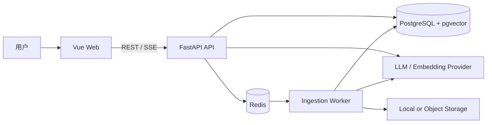
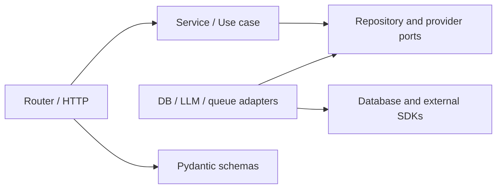

# SourceTrace 架构说明

## 1. 目标与约束

SourceTrace 是面向私有资料的可追溯 RAG 应用。系统必须同时满足：证据可定位、
答案可审计、证据不足时拒答、摄取任务可恢复，以及模型供应商可替换。

当前阶段采用模块化单体。API 与 Worker 独立部署，但共享领域和应用代码。该选择能保留
清晰边界与独立扩缩容能力，又避免在业务和容量尚未稳定时承担分布式事务与跨服务运维成本。

## 2. 系统上下文



## 3. 代码结构

```text
sourcetrace/
  apps/
    api/
      migrations/                 Alembic 数据库迁移
      scripts/                    OpenAPI 导出等开发脚本
      src/sourcetrace/
        api/                       路由聚合与 API 版本
        core/                      配置、日志、错误、中间件
        db/                        Engine、Session、ORM 基类
        modules/                   业务纵向切片
          health/                  存活与就绪检查
          <feature>/               router/service/repository/schema/model
        rag/                       RAG 跨模块编排与供应商端口
        workers/                   独立 Worker 进程入口
      tests/
        unit/                      纯逻辑测试
        integration/               API + 基础设施测试
        contract/                  OpenAPI 与适配器契约测试
    web/
      src/
        app/                       应用装配、路由、全局样式
        features/                  前端业务纵向切片
        shared/                    API 客户端和通用 UI
  docs/
    adr/                           架构决策记录
  evals/                           可版本化、去敏后的评测数据和配置
  infra/                           数据库、代理和部署配置
  scripts/                         跨应用工程脚本
  data/uploads/                    仅本地运行时数据
```

## 4. 后端依赖规则



依赖始终指向业务规则。Service 接受普通 Python 值或领域对象，不接受 `Request`、
`Response`、`HTTPException`。Repository 不决定“证据是否足够”等产品规则。外部供应商
实现端口接口，便于在单元测试中使用确定性的 fake。

一个典型请求的控制流是：

1. Router 校验输入并解析调用者上下文。
2. Service 执行业务规则和用例编排。
3. Repository/Provider adapter 访问 PostgreSQL、Redis 或模型 API。
4. Service 返回领域结果，Router 映射为稳定的 API schema。

## 5. 核心业务边界

| 模块 | 职责 | 不负责 |
|---|---|---|
| `knowledge_bases` | 知识库生命周期和访问范围 | 文档解析实现 |
| `documents` | 上传元数据、摄取状态、重试和删除 | 回答生成 |
| `retrieval` | 查询改写、召回、重排和证据集合 | HTTP 流式协议 |
| `answers` | 引用约束、拒答策略、回答会话 | 文档存储 |
| `identity` | 用户、会话和授权策略 | 业务资源查询 |
| `health` | 存活与依赖就绪状态 | 业务监控面板 |

这些目录应随对应纵向切片实现时创建，不预先生成无行为的空类。

## 6. 数据与任务

PostgreSQL 是业务状态和向量的权威存储。Redis 仅用于队列、短期缓存和任务协调，所有
缓存键都必须有 TTL。上传内容在数据库中只保存元数据与存储键，文件放本地开发目录或
对象存储。

文档摄取流程为：上传登记 -> 持久化原文件 -> 投递任务 -> 解析 -> 切分 -> 嵌入 ->
写入片段与向量 -> 标记完成。每一步以文档版本和处理阶段作为幂等键；失败进入有限重试，
最终进入失败状态供人工重放。

解析与切分阶段可独立落入 `chunked` 中间状态，供后续嵌入任务继续处理。`chunked` 版本
不可检索；只有向量完整写入并激活后才进入 `completed`。

BGE-M3 通过 `EmbeddingProvider` 端口接入，适配器负责批处理、1024 维契约和单位归一化
校验。Chunk 向量与文档版本的 `completed` 激活在同一个 PostgreSQL 事务中提交；检索范围
始终过滤为每个逻辑文档最新的 `completed` 版本，因此部分写入、处理失败和更新中的版本
不会进入召回范围，历史版本仍可按稳定 ID 访问。

## 7. API 契约

- 业务 API 位于 `/api/v1`，健康检查保持在 `/health` 与 `/ready`。
- 路径使用复数名词和 kebab-case，JSON 字段统一 snake_case。
- 列表默认 cursor 分页，默认 20 条、最大 100 条。
- 异步摄取返回 `202 Accepted` 和可查询的任务资源。
- 生成回答使用 SSE；事件类型和最终引用结构必须有版本化 schema。
- 错误采用统一 Problem Details 风格，并在响应头和响应体携带请求 ID。
- Web 类型从 OpenAPI 生成，后端 schema 是跨边界契约的唯一来源。

## 8. 可观测性与安全

- 每个请求生成或透传请求 ID，结构化日志记录边界事件和耗时。
- 日志不记录令牌、完整文档、模型完整提示词或个人敏感信息。
- `/health` 只表示进程存活；`/ready` 检查数据库和 Redis，失败时返回非就绪状态。
- 生产环境显式配置 CORS、可信代理、上传限制、速率限制和 HTTPS。
- 数据库迁移只通过 Alembic，破坏性变化拆为“新增、迁移、移除”多个发布步骤。

## 9. 何时拆分服务

仅在出现以下证据时考虑拆分：Worker 与 API 需要显著不同的资源配置；模块拥有独立团队
和发布周期；数据隔离或合规要求强制独立部署；或单体内已无法满足经测量的容量目标。
拆分前先通过端口接口稳定边界，并明确数据所有权和失败语义。
