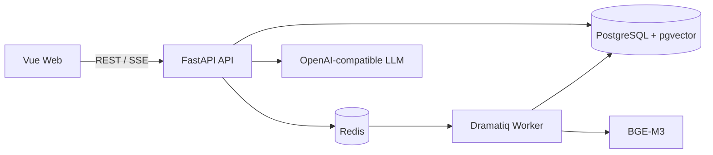
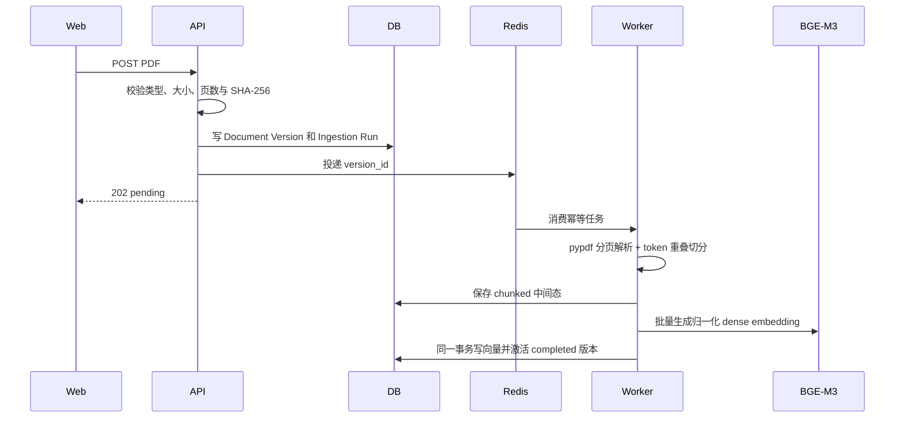
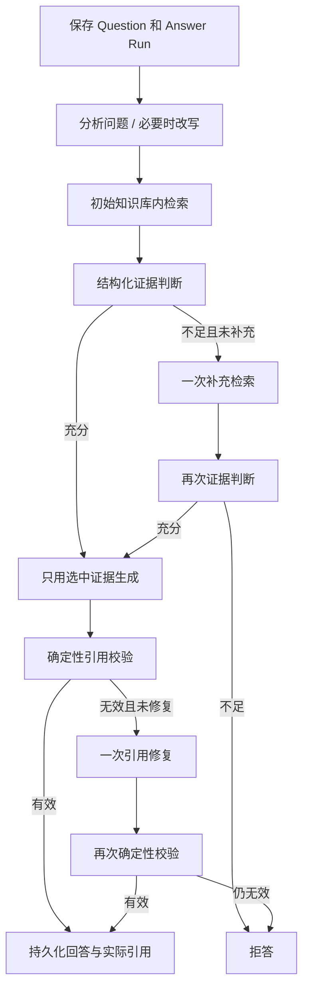

# SourceTrace 代码与面试 Walkthrough

## 1. 一分钟项目说明

SourceTrace 是严格基于知识库证据的 Agentic RAG。用户上传 PDF 后，系统异步解析、分页切分、
生成 dense embedding 并写入 pgvector。提问时，系统只在会话绑定的知识库与可检索文档版本
中召回证据，再由有界 LangGraph 工作流判断证据、最多补充检索一次、生成回答并确定性校验
引用。证据不足或引用无效就拒答，而不是使用模型内部知识补齐。

它适合在简历中体现 AI 应用开发与 Agent 工程能力，但面试前应能沿下面的调用链解释代码，
而不是只会演示页面。

## 2. 系统边界

这是模块化单体，不是微服务。API 与 Worker 是不同进程，但共享同一套业务模块。模块内部遵循
`router -> service -> repository`，模型、队列和存储通过端口或 adapter 接入。

| 目录 | 主要职责 |
|---|---|
| `modules/knowledge_bases` | 知识库边界、分页和删除 |
| `modules/documents` | 上传、不可变版本、摄取状态、解析、切分、索引 |
| `modules/conversations` | 会话作用域和不可变问题历史 |
| `modules/retrieval` | 有界查询规划、混合召回、RRF、reranker 和证据集合 |
| `modules/answers` | Answer Run 生命周期、SSE、引用/拒答持久化、取消 |
| `rag/workflow.py` | 有界 Agent 状态机和最终证据门禁 |
| `evaluation` | 数据集契约、分维度评分、离线与真实评测入口 |

## 3. 上传与摄取调用链

关键入口：

- HTTP：`modules/documents/router.py::upload_document`
- 上传用例：`modules/documents/service.py::DocumentUploadService`
- Worker actor：`workers/tasks.py::ingest_document_version`
- 解析切分：`modules/documents/ingestion.py::DocumentIngestionService`
- 向量激活：`modules/documents/indexing.py::DocumentIndexingService`

为什么要不可变文档版本：引用必须长期指向同一份内容；新版本摄取失败时，旧 completed 版本
仍可检索，不能把半成品暴露给回答链路。

为什么任务要幂等：Redis 采用至少一次交付语义，Worker 可能重试。同一 version 和阶段重复
执行不能生成重复 chunk，也不能把失败状态错误覆盖为成功。

## 4. 提问、Agent 与引用调用链

关键入口：

- SSE Router：`modules/answers/router.py::stream_answer`
- 生命周期：`modules/answers/service.py::AnswerService`
- 检索：`modules/retrieval/service.py::RetrievalService`
- Agent：`rag/workflow.py::AnswerWorkflow`
- 前端流解析：`features/answers/api/answers.ts::streamAnswer`
- 前端工作流：`features/answers/composables/useAnswers.ts`

Agentic 不等于无限自主。这里的 Agent 只能在固定图内选择“是否补充检索”和“选择哪些 chunk”，
次数都有上限。它不能联网搜索、换知识库或绕过引用校验。

引用为何还要确定性校验：模型输出是非可信文本。后端必须检查引用标签是否属于本轮允许的
chunk、正文是否实际引用、页码和文档版本是否匹配，再决定是否持久化。

## 5. SSE 与取消原理

SSE 是服务器到浏览器的单向长连接，适合“发起一次请求后持续接收状态和文本”。SourceTrace
不需要浏览器和服务器持续双向推送，所以没有使用 WebSocket。

回答事件包括 `status`、`delta` 和一个终态：`final`、`refusal`、`error` 或 `cancelled`。delta
只是界面草稿；只有 final 中通过校验的答案与引用可以写入数据库。

取消同时使用两条路径：浏览器中止流读取，并调用幂等取消端点。数据库先把活动 run 标记为
`cancel_requested`；工作流在节点边界和模型分片之间检查，再写入 `cancelled`。如果完成和
取消竞争，数据库条件更新决定唯一终态，前端随后从历史记录对账。

## 6. 检索、embedding 与 reranker 原理

BGE-M3 把查询和 chunk 映射到 1024 维 dense 向量并归一化。生产 repository 同时提供
pgvector cosine dense 通道和按查询条件启用的 PostgreSQL `english` lexical 通道；两个通道
各自有界召回，再通过版本化 RRF 融合。查询还必须同时过滤会话所属 Knowledge Base、Document
的 Active Searchable Version 和 completed 摄取状态。

复杂问题不会进入无限查询循环。原始 Question 始终执行；规划器最多增加两条有文档标题约束的
Retrieval Query，Evidence Decision 只能消耗剩余预算进行一次 Supplemental Retrieval。每条查询
的融合候选分别由固定 revision 的 `BAAI/bge-reranker-v2-m3` 交叉编码重排，再执行查询覆盖、
页面多样性和同页邻居扩展，最终主候选仍受 Top 8 限制。

为什么不能只换 embedding 或只加 reranker：reranker 只能调整已召回候选的顺序，无法恢复从未
进入候选池的 Chunk；lexical 通道适合精确术语，dense 通道适合语义表达，两者互补。相似度和
重排分数也不等于证据充分，因此召回之后仍有结构化 Evidence Decision 和最终 Citation 门禁。

## 7. 评测设计

评测把检索、引用、拒答和端到端分开，避免一个总分掩盖问题。Dataset 固定知识库和不可变
文档版本快照；Report 同时绑定代码提交、模型、四个 prompt、工作流、切分、embedding 和
检索配置。

常规 CI 使用确定性 fake，不调用真实供应商。真实评测必须使用用户审核的数据集并显式确认，
回答质量还要在运行后人工 judgment。这样能防止普通测试产生费用，也防止把旧人工结论套到
新的模型输出。

## 8. 关键取舍

| 选择 | 原因 | 代价 |
|---|---|---|
| 模块化单体 | 边界清晰、部署简单、适合单人项目 | 不能独立发布每个模块 |
| FastAPI + Vue | 契约清晰，OpenAPI 可生成前端类型 | 需要维护跨语言生成门禁 |
| Dramatiq + Redis | 有确认、重试和退避语义 | 增加 Worker 与 Redis 运维 |
| PostgreSQL + pgvector | 业务状态与向量事务一致 | 大规模向量场景可能需专用库 |
| 本地 BGE-M3 | 文档 embedding 不依赖付费 API | 模型缓存和 CPU/GPU 环境较重 |
| 远程回答模型 | 可替换 OpenAI-compatible 供应商 | 受网络、限流和模型别名影响 |
| SSE | 简单匹配单向流式回答 | 不适合通用双向实时协议 |
| 严格拒答 | 保证可追溯，不用内部知识补洞 | 覆盖率低于通用聊天机器人 |
| 全 Docker + 混合开发 | 最终交付可复现，日常仍有热更新 | 需要处理宿主机/容器路径差异 |

## 9. 常见面试问题

### 为什么这是 Agentic RAG，而不只是普通 RAG？

普通链路通常固定执行一次检索和一次生成。本项目由有界状态图根据结构化证据判断决定是否做
一次补充检索，并在引用失败时决定是否做一次修复；决策轨迹可持久化和重放。但它没有开放式
工具循环，因此成本和行为仍可控。

### 如何保证模型不会编造引用？

提示词约束只是一层。真正的保证来自后端确定性校验：生成器只能看到选中 chunk，引用 ID 必须
属于允许集合，正文必须实际使用引用；失败最多修复一次，仍失败就拒答。

### 为什么 Redis 不能作为权威状态？

队列消息可能重试、丢失可见性或过期。文档版本、Ingestion Run 和 Answer Run 都写 PostgreSQL，
Worker 根据数据库状态幂等恢复；Redis 只负责投递和短期协调。

### 为什么摄取完成要用事务激活？

如果先把版本标 completed 再写完向量，检索可能看到不完整数据。所有 chunk embedding 写入和
版本激活在同一事务提交，使“可检索”成为原子状态。

### 如何处理用户连续提问和取消？

数据库部分唯一索引保证每个 Conversation 最多一个活动 run。取消先持久化请求，工作流在安全
点停止；新问题只能在旧 run 终态化后开始。不同 Conversation 可以并发。

### 项目中最有价值的故障是什么？

Worker 的 async engine 跨事件循环故障。定位时先构造两次 `asyncio.run()` 的最小复现，再确认
Dramatiq actor 和全局连接池生命周期冲突，最后使用官方 AsyncIO middleware 和回归测试解决。
这说明异步代码的资源生命周期必须和事件循环生命周期一致。

### 当前项目最大的效果风险是什么？

检索侧已通过有界查询规划、dense/lexical RRF 和 BGE reranker 明显缩小固定数据集中的漏召回
范围，但真实供应商的生成具有波动性：即使检索与 Evidence Decision 已通过，初稿或一次
Citation Repair 仍可能因为缺失引用、结构化 JSON 偏差或供应商终态异常而被严格门禁拒答。
Issue #60 已增加声明级结构化修复、阶段化引用诊断和 DeepSeek 契约防护；当前最大风险是这些
修复尚未在同一版本化 30 题数据集上完成新的真实供应商回归与人工审核。不能用旧报告或一次
页面演示替代该验收，也不能通过放宽 Citation 或 Refusal 门禁换取更高通过数。

## 10. 简历表达边界

可以陈述：实现了严格证据约束的 Agentic RAG、异步 PDF 摄取、pgvector 检索、SSE 取消、
LangGraph 有界决策、版本化评测框架和完整 Compose 交付。

不能陈述：未经 reviewed 真实评测得到的准确率、召回率、延迟、吞吐量或镜像优化比例。建议
先按本文逐段阅读对应代码，再把自己能够解释和复现的部分写入简历。
